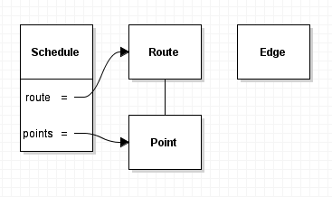

# Постановка задачи:
Реализовать два сервиса:
  - Первый сервис(серв1):
    1. Добавляет маршрут; 
       - На вход получает массив ид точек маршрута, на выход возвращает ид маршрута.
       - При добавлении маршрута вызывает второй сервис для расчета времени, необходимого для его прохождения, и сохраняет результат расчёта.
    1. Выводит список маршрутов ( с массивом точек маршрута).
    1. Выводит отдельный маршрут ( с массивом точек маршрута).
 
  - Второй сервис(серв2):
    1. По точкам из маршрута возвращает время, которое нужно затратить на этот маршрут(-1 если не достижимо).

## Функциональные требования:
 1. Предусмотреть, что каждый сервис может использовать свою базу данных.
 1. Формат api – JSON
 1. Серв1 могут использовать все
 1. Серв2 могут использовать только другие сервисы
 1. организовать доступ по ролям

## Сущности:
Сущности установлены условием задачи:
```
Маршрут:
    id – int
    is_ready – bool //посчитано ли время на маршрут
    time – int // время на маршрут в минутах
Точки маршрута:
    id – int
    id_route – int //ид маршрута
Граф точек маршрутов:
    id_point_one – int // ид первой точки
    id_point_second -  int //ид второй точки
    time – int // время на преодоления расстояния между двумя точками
```

## Замечание
Сущности заданы условием и не подлежат изменению. Однако для увеличения возможностей 
расширения функционала можно было бы разделить сущность "Маршрут" на две. Одна часть 
отвечала бы за сущность "Маршрут", а вторая за время, необходимое для прохождения маршрута.
К первой относились бы слабоизменяемые или неизменяемые атрибуты, а вторая могла бы
гибко изменяться при редактировании маршрута. 

# Анализ
Условия задачи полностью описывают предметную область.
Именование объектов:

Сущность          | Программный объект 
-------------------|-------------------
 Маршрут           | Route              
 Точка             | Point             
 Ребро графа точек | Edge              

Синтетические объекты:

Сущность          | Программный объект | Описание
-------------------|-------------------|------------------------
 Расписание        | Schedule          | Связь маршрута и точек

Диаграмма объектов:

 

# Архитектура

## Структура проекта
Для организации и сборки программных модулей использован <b>Maven</b>.
 
## Структура приложения
Для построения структуры приложения используется <b>Spring framework</b>. 
 
## Безопасность
Для разграничения доступа к ресурсам используем <b>Spring security</b>. 
 
## База данных
Для хранения и доступа к данным использована <b>HSQLDB</b>.

# Модули
Программный комплекс представляет собой три модуля:

Модуль   | описание
---------|---------
trace    | реализация серв1
timing   | реализация серв2
utilites | вспомогательные утилиты

Каждый из двух модулей, реализующих сервисы, декомпозирован на четыре части:

Подмодуль | Описание
----------|-------------------
entities  | библиотека объектов и возможных ошибок, а также карта <b>REST</b> запросов к сервису.  
service   | базовые действия над программными объектами 
server    | реализация веб сервиса
client    | модуль для доступа к веб сервису

Такое разделение помогает снизить количество зависимостей.
При реализации модуля `client` необходимы лишь программные объекты, возможные ошибки и карта запросов из `entities`.
`server` содержит реализацию бизнес требований, при этом карта запросов для `client` и `server` связаны,
что исключает рассинхрон при разработке и проблемы при изменении карты запросов в новой версии (при сохранении интерфейса).   

## Общая идея реализации модулей
### `entities`
В данный модуль вынесены программные объекты которыми манипулирует сервис, ошибки которые могут возникнуть
при работе с объектами.
Также для связи модулей `client` и `server` в этот модуль вынесена карта `http` запросов, что позволяет
снизить вероятность рассинхрона первого и второго.
    
### `service`
Задача данного модуля реализовать функции создания, изменения и доступа к объектам,
а также предоставить простой интерфейс для этих действий.

При решении первой задачи (в терминах `MVC`) данные в БД являются `model`, програмные объекты `view`, 
а сервисы доступа `controll`. 

Конфигурирование соединений с БД осуществляется в xml файле, без использования аннотаций,
для возможности быстрой правки соединения без перекомпиляции всего приложения. 

Для решения второй задачи выделим отдельный класс который будет являтся `фасадом` данного модуля.
   
### `server`
Реализация бизнес логики и сервлетов для взаимодействия по http.

### `client`
Набор классов для обеспечения доступа к сервисам приложения по http.   

## Как запустить?
Для сборки использовать Maven. После успешной сборки выполнить деплой war файла приложения в любой 
сервлет контейнер, например Tomcat. 

## Использовались

* [Maven](https://maven.apache.org/)
* [Spring](https://spring.io/)
* [gson](https://github.com/google/gson)
* [junit](https://junit.org/junit5/)

## Автор

* **Николаев А.С.**